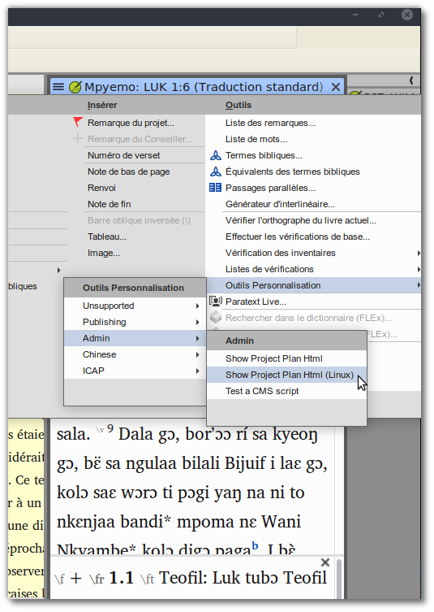

# ProjectPlanHtmlLinux.cms

Paratext includes a way display Project Plans as HTML, but the existing scripts
assume a Windows OS. These files add an entry to the Project Menu:
> "Personalization Tools" > "Admin" > "Show Project Plan Html (Linux)"

This script imports from Mike Herchenroeder's `ProjectPlanHtml.py` and liberally
reuses content that couldn't be imported from other files. His scripts should
be considered a prerequisite for these based on the current structure.

These could be cleanly separated out from Mike's scripts, but ideally the two
would instead be integrated together into one set.

## How to Use

- Click on the "Code" button above and choose "Download ZIP".
- Extract the "ProjectPlan..." files from the `cms` folder into `~/Paratext8Projects/cms`.
- Start Paratext9 and find the new entry in the Project Menu:
  
